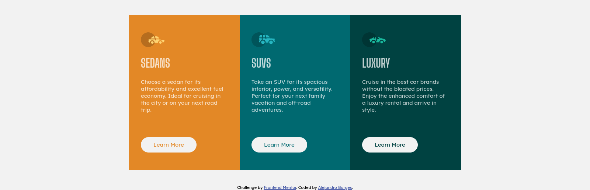

# Frontend Mentor - 3-column preview card component

This is a solution to the [3-column preview card component challenge on Frontend Mentor](https://www.frontendmentor.io/challenges/3column-preview-card-component-pH92eAR2-). Frontend Mentor challenges help you improve your coding skills by building realistic projects. 

## Table of contents

- [Overview](#overview)
  - [The challenge](#the-challenge)
  - [Screenshot](#screenshot)
  - [Links](#links)
- [My process](#my-process)
  - [Built with](#built-with)
  - [What I learned](#what-i-learned)
  - [Continued development](#continued-development)
  - [Useful resources](#useful-resources)
- [Author](#author)
- [Acknowledgments](#acknowledgments)

## Overview

### Screenshot




### Links

- Solution URL: [Source Code](https://github.com/AlexdelCarmen/3-column-preview-component)
- Live Site URL: [Live Page](https://alexdelcarmen.github.io/3-column-preview-component/)

## My process

I structured the HTML first, with a mobile layout first mindset, then styled it for mobile screens, and lastly, added a media query to handle desktop displays.

### Built with

- Semantic HTML5 markup
- CSS custom properties
- Flexbox
- Mobile-first workflow


### What I learned

Liked how the styling on my buttons came along.  

```css
.card-button {
  background-color: var(--light-2);
  border: 2px solid var(--light-2);
  margin-top: 50px;
  font-family: var(--main-font);
  font-size: var(--paragraph-size);
  padding: 0.6rem 2rem;
  border-radius: 30px;
}


```

### Continued development

Still needing to get a better eye for sizes/colors.

### Useful resources

- [W3Schools](https://www.w3schools.com/) - general resource for coding, used it for :root clarifications.

## Author

- Website - [Github Profile](https://github.com/AlexdelCarmen)
- Frontend Mentor - [@AlexdelCarmen](https://www.frontendmentor.io/profile/AlexdelCarmen)
- Twitter - [@AlekBorchov](https://twitter.com/AlekBorchov)

## Acknowledgments

Thanks Wendigoon for ranting on the back for hours on end while I code.
